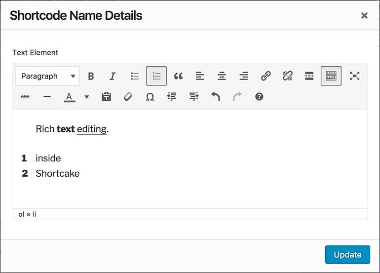

<!-- DO NOT EDIT THIS FILE; it is auto-generated from readme.txt -->
# Shortcake (Shortcode UI) Richtext

Plugin for adding rich text editing capabilities to textareas in Shortcake.

**Contributors:** [xwp](https://profiles.wordpress.org/xwp), [mihai2u](https://profiles.wordpress.org/mihai2u)
**Tags:** [shortcodes](https://wordpress.org/plugins/tags/shortcodes)
**Requires at least:** 4.3
**Tested up to:** 4.6
**Stable tag:** trunk (master)
**License:** [GPLv2 or later](http://www.gnu.org/licenses/gpl-2.0.html)

## Description ##

This plug-in extends on the capabilities of [Shortcake (Shortcode UI)](https://ro.wordpress.org/plugins/shortcode-ui/) by adding rich text editing capabilities to textarea inputs in the Shortcake interface, when the specific textarea constructors contain the shortcake-richtext class name.

## Installation ##

You need [Shortcake (Shortcode UI)](https://ro.wordpress.org/plugins/shortcode-ui/) already installed and activated.

1. Upload the plugin files to the `/wp-content/plugins/shortcode-ui-richtext` directory.
2. Activate the plugin through the 'Plugins' screen in WordPress
3. Add the meta class option to the textarea input type of an existing shortcake register_for_shortcode call
```php
'meta'  => array(
	'class' => 'shortcake-richtext',
),
```

## Frequently Asked Questions ##

### How does an example rich textarea input element shortcake register code looks like? ###
This is a default shortcode with a single textarea:

```php
shortcode_ui_register_for_shortcode( 'shortcode_name',
	array(
		'label'         => esc_html__( 'Shortcode Name', 'namespace' ),
		'listItemImage' => 'dashicons-text',
		'attrs'         => array(
			array(
				'label' => esc_html__( 'Text Element', 'namespace' ),
				'attr'  => 'text_element',
				'type'  => 'textarea',
			),
		),
	)
);
```

This is the same code with the richtext capability added in on the text_element:

```php
shortcode_ui_register_for_shortcode( 'shortcode_name',
	array(
		'label'         => esc_html__( 'Shortcode Name', 'namespace' ),
		'listItemImage' => 'dashicons-text',
		'attrs'         => array(
			array(
				'label' => esc_html__( 'Text Element', 'namespace' ),
				'attr'  => 'text_element',
				'type'  => 'textarea',
				'meta'  => array(
						'class' => 'shortcake-richtext',
				),
			),
		),
	)
);
```


## Screenshots ##

### This screenshot shows a rich text enabled textarea in the Shortcake interface.



### Here the code view of the editor is visible.


## Changelog ##

### 0.1 ###
Initial release.


## Upgrade Notice ##

### 0.1 ###
Initial version. No need to upgrade.


